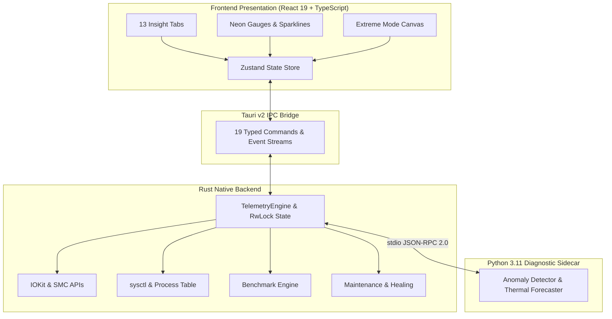

# VelocityCore v3.0

> Professional macOS System Intelligence, Dynamic Benchmarking, and Anomaly Detection Platform engineered for Apple Silicon.

---

## ⚡ Overview

**VelocityCore** is a native macOS system monitor, hardware benchmarker, and automated diagnostic suite. Engineered with **Tauri v2**, **Rust**, **React 19**, and a dedicated local **Python diagnostic sidecar**, VelocityCore provides real-time visibility into Apple Silicon architecture with zero cloud telemetry dependencies.

It includes 13 dedicated insight tabs, a 9-subsystem telemetry engine, hardware-stress testing ("Extreme Mode"), system remediation tools, and an interactive 3D web companion landing page.

---

## 🌟 Core Features

- **9-Subsystem Hardware Telemetry**:
  - High-frequency (500ms) polling across CPU, GPU, RAM, Thermal, Battery, Storage, Network, Process tree, and SMC sensors.
  - Native IOKit and `sysctl` metric bindings in Rust for near-zero CPU overhead.
- **Dynamic Silicon Benchmarking Suite**:
  - 9 standardized performance suites: Single/Multi-core Integer, Floating Point, Cryptography, Memory Bandwidth, and Sequential/Random 4K Disk I/O.
  - Baseline comparison tables tailored for M1, M2, M3, and M4 chips.
- **Extreme Mode & Caffeinate Integration**:
  - Reactor-grade thermal stress monitor with Canvas 2D live particle dynamics.
  - One-click system sleep prevention via native `caffeinate` bridge during demanding compile or render jobs.
- **Self-Healing & Deep Maintenance**:
  - Automatically identifies memory pressure, swap bloat, Rosetta 2 emulation overhead, and stale kernel extensions.
  - Safe 13+ target disk reclamation (Xcode `DerivedData`, simulator runtimes, npm/pip/Homebrew caches, and Trash).
- **Zero-Network AI Diagnostic Sidecar**:
  - Standalone Python 3.11 service communicating over `stdio` via JSON-RPC 2.0 for real-time anomaly detection and thermal trend forecasting.
- **Web Companion Showcase**:
  - Interactive React 19 + Spline 3D web companion showcasing platform architecture and telemetry visualizers.

---

## 🏗️ Architecture Stack



---

## 📋 System Requirements

| Component | Minimum | Recommended |
| :--- | :--- | :--- |
| **Operating System** | macOS 13.0 Ventura | macOS 14.0+ Sonoma |
| **Architecture** | Apple Silicon (M1 or newer) | Apple M2 / M3 / M4 |
| **Node.js** | 18+ | 20+ LTS |
| **Rust** | 1.75+ | Latest Stable |
| **Memory** | 8 GB RAM | 16 GB+ RAM |

---

## 🚀 Getting Started

### 1. Clone Repository

```bash
git clone https://github.com/PrachyatMisra/velocity-core.git
cd velocity-core
```

### 2. Install Dependencies & Build Sidecar

```bash
# Install frontend dependencies
npm install

# Setup and package Python diagnostic sidecar
npm run sidecar
```

### 3. Launch Development Environment

```bash
# Starts desktop application in dev mode with live reload
npm run tauri:dev
```

### 4. Build macOS App / DMG

```bash
# Generates release binary and DMG bundle in target/release/bundle/
npm run build:dmg
```

---

## 🌐 Web Companion Showcase

VelocityCore includes a standalone web showcase in the `web/` directory built with React 19, Vite, Tailwind CSS, and Spline 3D:

```bash
cd web
npm install
npm run dev
```

The web companion can be deployed to GitHub Pages or Vercel for live demonstration.

---

## 🔒 Security & Privacy Architecture

- **100% On-Device**: Zero telemetry or metric data leaves your local machine.
- **Sandboxed Sidecar**: Communicates exclusively over `stdio` pipes; no network ports are opened.
- **Safe Maintenance**: Scans only user-accessible development and cache directories without modifying system binaries or protected OS volumes.

---

## 🤝 Contributing

Contributions are welcome! Please check [CONTRIBUTING.md](CONTRIBUTING.md) for code style guidelines, testing steps, and branch conventions.

For security reports, review [SECURITY.md](SECURITY.md).

---

## 📄 License

This project is licensed under the [MIT License](LICENSE).
